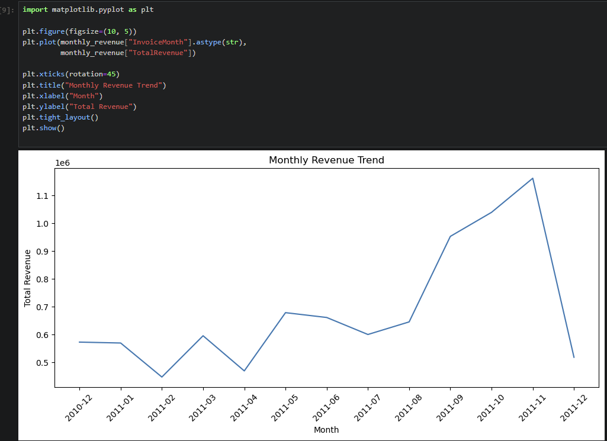

# Online-retail-python-analysis
Exploratory data analysis and customer insights using Python (pandas, matplotlib).

## 📊 Key Analysis & Visualizations

### Monthly Revenue Trend
The chart below shows the monthly revenue trend over time, helping identify seasonality and revenue growth patterns.

**Insight:** Revenue shows a strong upward trend toward the end of the year, indicating possible seasonality and increased customer demand in Q4.

---

### 🌍 Top Countries by Revenue

This analysis identifies the countries contributing the highest revenue to the business.

**Insights:**
- The United Kingdom generates the highest share of total revenue, significantly outperforming other countries.
- A small number of countries contribute the majority of sales, indicating strong geographic concentration.
- This suggests opportunities for targeted international expansion or deeper market penetration outside the UK.
